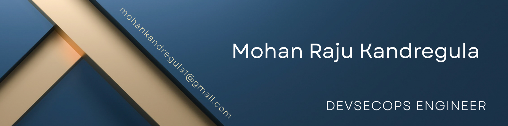

# 👋 Hi, I'm Mohan Raju Kandregula

🚀 **Cloud & DevOps Engineer | Site Reliability Engineer (SRE)**
📍 Chennai, India
📧 [mohankandregula1@gmail.com](mailto:mohankandregula1@gmail.com)
🔗 [LinkedIn](https://www.linkedin.com/in/mohanrajuk) | [GitHub](https://github.com/mohan6451)

---

## 🧑‍💻 About Me

I am a Site Reliability Engineer with **3+ years of experience** in building and managing **scalable, secure, and highly available cloud infrastructure** across AWS and Azure.

I specialize in:

* Improving **system reliability & uptime**
* Automating infrastructure using **Terraform & CI/CD pipelines**
* Implementing **observability and monitoring solutions**
* Handling **critical production incidents (P1/P2)** end-to-end

💡 I focus on reducing downtime, improving MTTR, and building resilient systems.

---

## ⚙️ Tech Stack

### ☁️ Cloud Platforms

* AWS
* Azure

### 🏗️ DevOps & Infrastructure

* Terraform
* Docker
* Kubernetes

### 📊 Monitoring & Observability

* Datadog
* New Relic

### 🔄 CI/CD

* Jenkins
* GitHub Actions
* Azure DevOps

### 💻 Programming & Scripting

* Python
* Shell Scripting

### 🔐 Identity & Access

* SSO (SAML, OAuth)

### ⚡ Other Tools

* Ansible
* Git
* Agile / Scrum
* Ivanti & Cherwell

---

## 💼 Experience

### **Cloud Operations Engineer**

📍 Awan Infotech | Nov 2022 – Present

* Monitored infrastructure using Datadog & New Relic dashboards
* Handled **L1/L2/L3 support & P1/P2 incidents** with full ownership
* Performed **Root Cause Analysis (RCA)** and implemented preventive fixes
* Built CI/CD pipelines using Jenkins, GitHub Actions & Azure DevOps
* Automated infrastructure provisioning using Terraform
* Deployed and managed applications using Docker & Kubernetes
* Reduced downtime through proactive monitoring and alerting
* Developed automation scripts using Python & Shell

---

## 🚀 Projects

### 🔐 One Access – SSO Implementation

* Implemented centralized **Single Sign-On (SSO)** solution
* Integrated apps using **SAML & OAuth**
* Connected systems: AWS, Greythr, FortiGate, CrowdStrike, Zabbix
* Improved security and user experience

---

### 📊 Caladrius – Observability Platform

* Designed monitoring solution using **Datadog**
* Deployed agents in Kubernetes (DaemonSets)
* Built dashboards & real-time alerting
* Managed PostgreSQL & MongoDB via StatefulSets
* Improved **system visibility & reduced MTTR**
* Secured configs using Kubernetes Secrets

---

## 🏆 Key Achievements

* ✅ Achieved **99.9%+ uptime**
* ⚡ Reduced **MTTR for production incidents**
* 🚀 Improved deployment speed using CI/CD automation
* 🔐 Strengthened security via centralized SSO

---

## 📜 Certifications

* Microsoft Certified: Azure Administrator Associate (AZ-104)
* Microsoft Certified: Azure Fundamentals (AZ-900)

---

## 🎓 Education

**Bachelor of Engineering (Mechanical)**
2015 – 2018

---

## 📈 What I’m Working On

* Improving Kubernetes production deployments
* Advanced observability & alerting strategies
* Infrastructure automation at scale

---

## 🤝 Let's Connect

If you're looking for someone who can:

* Improve system reliability
* Automate infrastructure
* Handle real-world production issues

👉 Feel free to connect or reach out!

  
  
  
  
  
  
  
  
  
  
  
  
  
  
  
  
  
  
  
  
  
  
  

###

<h1 align="center">Hi 👋, I'm Mohan Raju K</h1>
<h3 align="center">A passionate Devops Engineer</h3>

- 🔭 I’m currently working at **AWAN InfoTech**

- 📫 How to reach me **mohankandregula1@gmail.com**

###

# 📊 GitHub Stats:
 
 

---